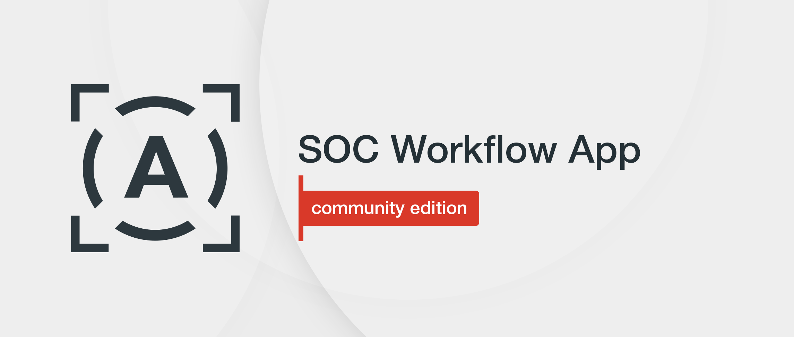
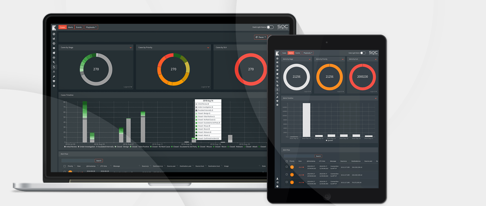

SOC Workflow App helps Security Analysts and Threat Hunters:
 - Explore suspicious events
 - Look into raw events arriving at the Elastic Stack
 - View Saved Searches configured by teammates
 - Carry out investigations based on automatically generated alerts from SIEM, EDR, and IDS arriving at the Elastic Stack, as well as Elastic Machine Learning alerts, and Threat Intelligence data enrichments from Anomali ThreatStream & MISP



# SOC Workflow App Installation
To install the SOC Workflow App for your Kibana:

1. Copy the soc_workflow_ce-xxxxx.zip file to Kibana server and run the following command:
  
    ```sh
    /usr/share/kibana/bin/./kibana-plugin install file:///PATH_TO_FILE/soc_workflow_app_ce/dist/soc_workflow_ce-xxxxx.zip
    ```

2. Wait until the installation finishes. It may take a few minutes to optimize and cache browser bundles.

        If you get an error: “Plugin installation was unsuccessful due to error "Incorrect Kibana version in plugin [soc_workflow_ce]. Expected [7.6.1]; found [7.2.0]”, take the following steps:
        1. Open the zip archive.
        2. Modify the ./kibana/soc_workflow_ce/package.json file by inserting the current version of your Kibana to the version field.

3. Restart Kibana to apply the changes.

        If after restarting Kibana, you still don’t see any changes:
        1. Go to the /usr/share/kibana/optimize folder. 
        2. Delete all files in this folder including subfolders.
        3. Restart Kibana. This will make Kibana refresh its cache.

4. SOC Workflow App CE uses the following indices:
    * alerts_ecs*
      > For events that need to be investigated by SOC, such as correlation events generated by Logstash or scripts
    * alerts_logs*
      > For workflow stages and comments history
    * case_ecs*
      > For storing cases
    * case_logs*
      > For case stages and comments history
    * sigma_doc
      > For storing Sigma documents for data enrichment
    * playbook
      > For Playbooks

    Create index templates for these indices from the following files:
     * index_template_ecs_new.txt
     * index_template_alerts_case_logs.txt
     * index_template_playbook.txt
     * Index_template_sigma_doc.txt

5. Add Playbooks to the index from the application or add your own ones in the same format.

    a. Run commands in the Dev Tools Kibana console from the `playbooks_to_elastic.txt` file.
    Here’s the Playbook format:
        
        "@timestamp": "1530687175111",
        "playbook_name" : "Playbook",
        "playbook_body" : "PUT HERE TEXT OF YOUR PLAYBOOK IN HTML CONVERTED TO BASE64"

    b. Edit the following file to add mapping of your own alerts to Playbooks:
    
        /usr/share/kibana/plugins/soc_workflow_ce/config/playbook_alert_links.json

        "Brute Force Detection Advanced": [
            "User Brute Force",
            "Server Brute Force Detection"
        ]

        Where:
        "Brute Force Detection Advanced" is the name of the Playbook
        "User Brute Force", "Server Brute Force Detection" are alert names in the alert-ecs* index 
        
        For these alerts, the "Brute Force Detection Advanced" Playbook will be automatically assigned in the SOC Workflow App.

6. Load Sigma documents to the sigma_doc index:

    a. Go to the resources/ELK_import_export folder.  
    b. Modify the es_config.py script by inserting there the Elasticsearch hostname, username, and password.  
    c. Run the following command:

    `python /PATH_TO_FILE/ELK_import_export/import_es_index.py`  
    
    Indices will be created and filled with Sigma rules.

        Note: You should have the Elasticsearch module.
    
    For Python 2.7, install the Elasticsearch module using this command:

    `pip install elasticsearch`

7. Configure external commands to run scripts/commands and make lookups to the third-party services by editing the `/usr/share/kibana/plugins/soc_workflow_ce/config/data_actions.json` file:
    ```json
    [
        {
           "Menu": [{
               "Submenu": [{
                   "name": "Command 1",
                   "command": "/bin/sh /opt/scripts/script1.sh \"[[value]]\""
               }]
           }]
        },
        {
           "name": "Command 2",
           "command": "/usr/bin/python2.7 /opt/scripts/scripts2.py -v \"[[value]]\""
        },
        {
           "name": "Command 3",
           "command": "/usr/bin/python2.7 /opt/scripts/script3.py -i [[value]]"
        }
    ]
    ```
    Where:
    
        "name" displays the name of the lookup command
        "link" is the link for drill-down. Insert [[value]] to the appropriate place within the link to send the field value from the alert/case

8. Copy predefined scripts for data enrichment and response to the Kibana `/opt/scripts` folder.

9. Run the following commands:

        chown -R kibana:kibana /opt/scripts
        chmod +x /opt/scripts/*.sh

**Now you can use the SOC Workflow App.**

# SOC Workflow App Update

1. Back up all config files in the `/usr/share/kibana/plugins/soc_workflow_ce/config/` folder.
2. Remove the `/usr/share/kibana/plugins/soc_workflow_ce/` folder.
3. Install the application from the new version archive.
4. Remove Kibana cache — all files and subfolders in the `/usr/share/kibana/optimize/` folder. Do not delete this folder.
5. Update or add new templates for data if needed.
6. Copy backed up configuration files to the `/usr/share/kibana/plugins/soc_workflow_ce/config/` folder. 
7. Restart Kibana.


        Note:
        Restarting Kibana may take a while due to cache rebuilding.
